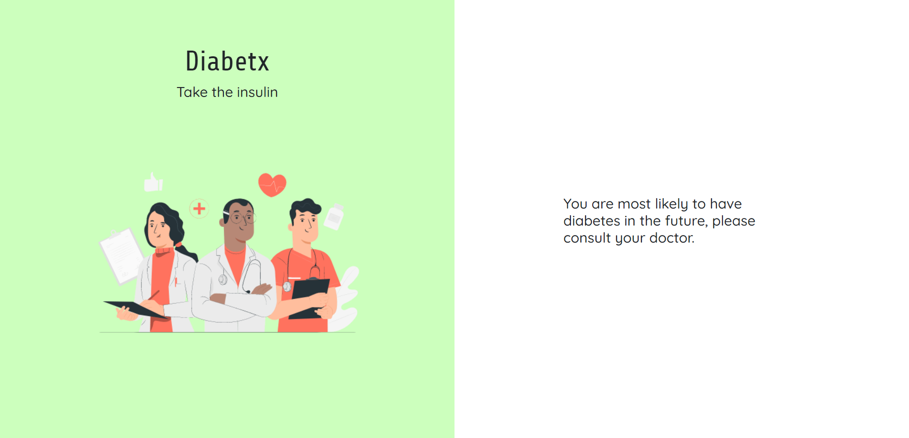

## Diabetx - Take the Insulin





### Tech Stacks Used:

- HTML
- CSS
- Bootstrap
- Flask
- Keras
- Tensorflow
- Deep Learning

### Get Started

1) Set up a virtual environment to use for our application.
```sh
conda create -n myenv python=3.8
```
2) You then need to activate the environment created.
```sh
conda activate myenv
```
3) Install required libraries:
```sh
pip install flask
pip install keras
pip install tensorflow
```
4) Create a new working directory for the project
```sh
mkdir new-ws
```
5) Cd to the workspace and clone the git repo.
```sh
cd new-ws
git clone [URL]
```
6) Run the app in local environment using python
```sh
python app.py
```

### Get Involved

*  Read [Community Guidelines](<https://github.com/yadvi12/Diabetx/blob/main/CONTRIBUTING.md>) for all
   kinds of ways to contribute to and interact with the project,
   including how to submit bug reports and
   code to Diabetx.
*  Submit a proposed code update through a pull request to the ``master`` branch.
*  Talk to us before making larger changes
   to avoid duplicate efforts. This not only helps everyone
   know what is going on, it also helps save time and effort if we decide
   some changes are needed.
